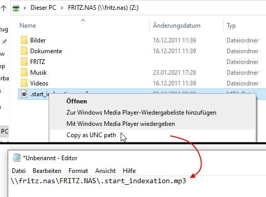

# Unc2Clipboard

Copy a file path as UNC path into the clipboard via Explorer's context menu

Usage:

  Put this executable in the folder of your liking (should be accessible for all users)

  Install with argument --install, uninstall with --uninstall

  You will have to confirm a UAC request in order to write the keys into the registry

  After that, you're set. Just right click on a file or folder and select "Copy as UNC path"

